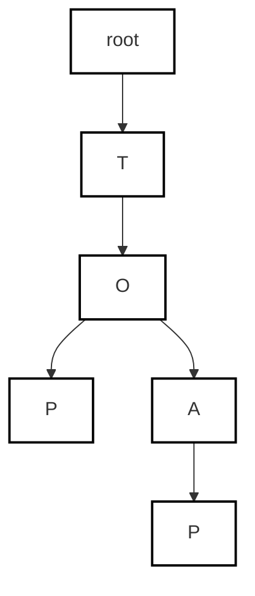
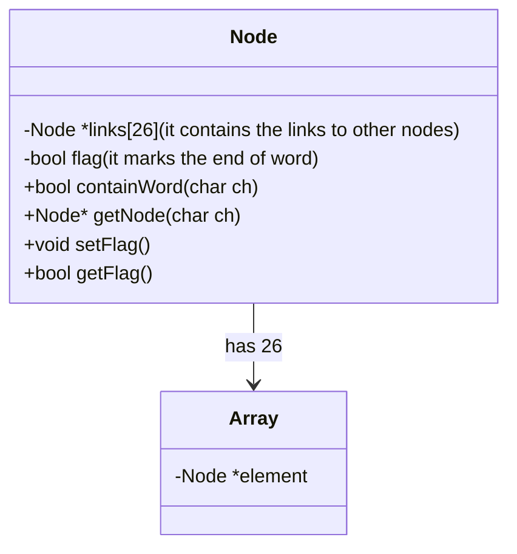

# Introduction to Trie

## What is a Trie?

A trie is a tree like data structure and this is used to store a word dynamically over nodes.



> the above graph shows a trie data structure consisting of
> words such as to and top

## Usage as a data structure

1. lookup words in dictionaries
2. ip routing
3. efficient memory storage
4. and so on..

## pseudocode implementation

```c++

struct node {
    node *links[26]; 
    bool flag = false;

    bool containWord(char ch){
        return links[ch - 'a'];
    }

    node *getNode(char ch){
        return links[ch - 'a']
    }

    void setFlag(){
        flag = true;
    }

    bool getFlag(){
        return flag;
    }

};

class trie {
    private:
        node *root;
    public:
        Trie(){
            root = new node()
        }

        void insert(string word) {
            node *node = root;
            for (int i = 0; i < word.length(); i++){
                if (!node->containWord(word[i])){
                    node->putWord(word[i],new Node());
                }
                node = node->getNode(word[i]);
            }
            node->setFlag();
        }
        bool search(string word) {
            node *node = root;
            for (int i = 0; i < word.length(); i++){
                if (!node->containWord(word[i])){
                    return false;
                }
                node = node->getNode(word[i]);
            }
            return node->getFlag();
        }
    
        bool startsWith(string prefix) {
            node *node = root;
            for (int i = 0; i < prefix.length(); i++){
                if (!node->containWord(prefix[i])){
                    return false;
                }
                node = node->getNode(prefix[i]);
            }
            return true;
        }
}
```

